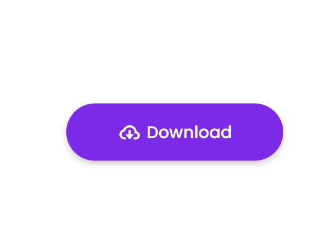
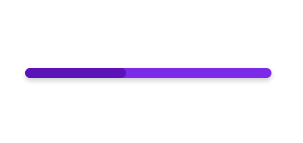
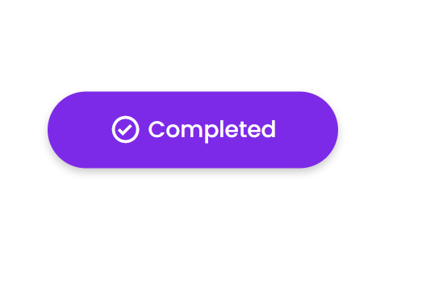

# Desafio Rocketseat para 21 dias de códigos

<h2>Regras</h2>

<h3>Todos os dias, voce vai ter que codar por pelo menos uma hora</h3>
 
<h3>Você deve compartilhar todos os dias o seu progresso nas suas redes socias e marcar o @rocketseat com a hastag #21diaseecodigo uqe iremos repostar.</h3>
 
<h3>Todos os dias, voce vai ter que codar por pelo menos uma hora</h3>
  
<h3>Gerar networking com as pessoas que estão participando desse desafio</h3>

-------------------------------------------------------------------------------------------------------------------------------------------------------

<h1> 2 dia de desafio </h1>
<h2>Faça um Hello World customizado com fontes, cores e imagens.</h2>

-----------------------------------------------------------------------------------------------------------------------------------------------------

<h1>3 dia de desafio </1>

<h2>Crie botão animado</h2>

------------------------------------------------------------------------------------------------------------------------------------------------------

<h1>4 dia de desafio </1>
